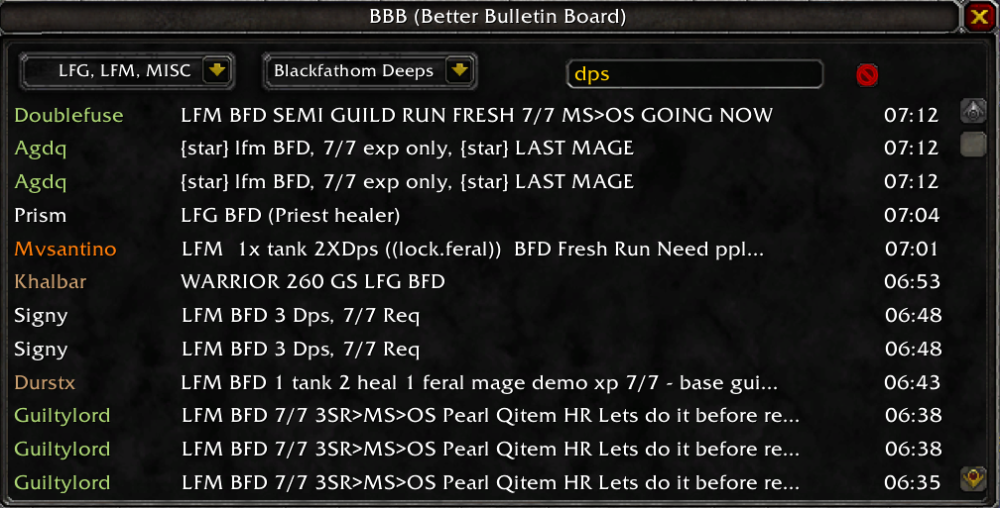

# Better Bulletin Board (BBB) - World of Warcraft Addon

Better Bulletin Board (BBB) is a World of Warcraft (WoW) addon designed to enhance the in-game bulletin board functionality for organizing groups and events. It provides an improved interface for managing and responding to LFG (Looking For Group) and LFM (Looking For More) messages, along with various features to streamline group coordination.

## Features

- **Dropdown Menus**: Convenient dropdown menus to select between LFG and LFM modes and choose specific dungeons or activities.
- **Interactive Lists**: Displays posted messages in a user-friendly list format for easy viewing and interaction.
- **Right-Click Functionality**: Allows right-click actions on posted messages, such as inviting, ignoring, whispering, and more.

## Installation

1. Download the addon folder.
2. Extract the contents into the WoW `Interface/AddOns` directory.
3. Restart WoW or send `/reload` command in the chat."

## Contributions and Issues

Contributions, suggestions, and bug reports are welcome! Feel free to open an issue or pull request.
